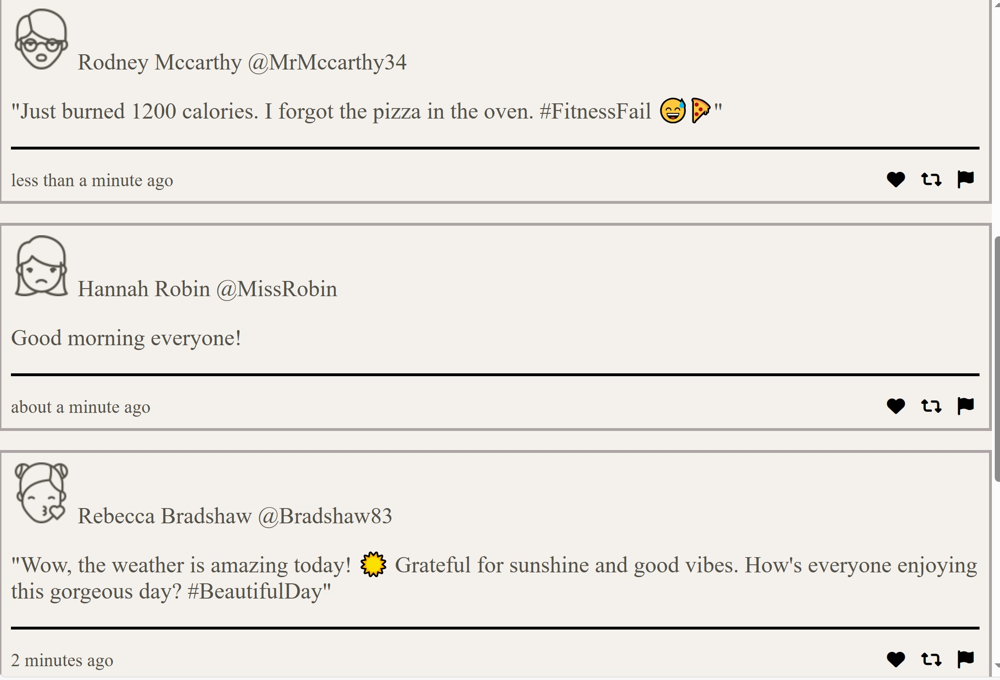
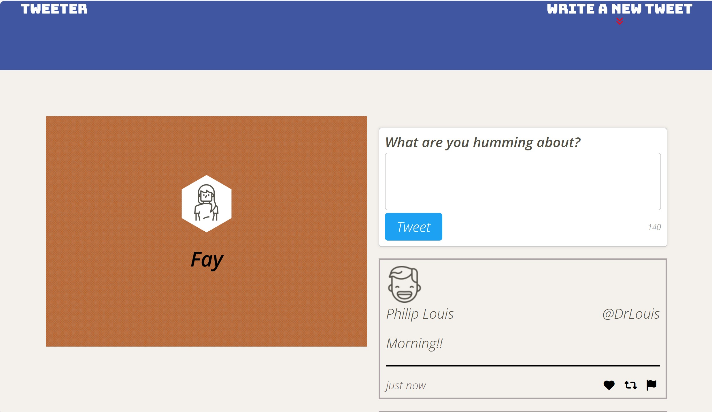

# Tweeter Project

Tweeter is a responsive web application that allows users to post and view tweets. It features a mobile-first design, ensuring a seamless user experience across various screen sizes.

## Final Product

*Tweets posted*

*Responsive Design*

## Getting Started

1. Clone your repository onto your local device.
2. Install dependencies using the `npm install` command.
3. Start the web server using the `npm run local` command. The app will be served at <http://localhost:8080/>.
4. Go to <http://localhost:8080/> in your browser.

## Dependencies

- Express
- Node 5.10.x or above

## Enjoy Tweeter!

- Whether you're sharing your thoughts or reading tweets, we hope you have a fantastic experience.
